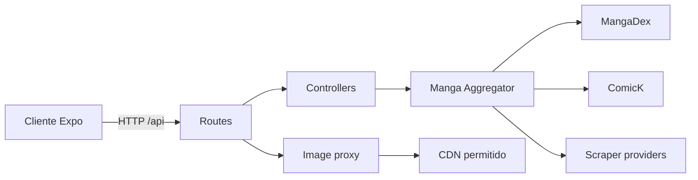

<div align="center">

# API My Manga Online

**API REST agregadora y normalizada para catálogos de manga.**

[](https://nodejs.org/)
[](https://expressjs.com/)
[](https://www.typescriptlang.org/)
[](#calidad-y-pruebas)
[](#licencia-y-uso)

</div>

<p align="center">
  
</p>

API My Manga Online desacopla el cliente de los detalles de cada proveedor. Consulta fuentes externas, normaliza mangas, capítulos y páginas en contratos estables, y protege el acceso a imágenes remotas mediante un proxy controlado.

## Capacidades

- Búsqueda en una fuente concreta o en todas las fuentes habilitadas.
- Catálogo agregado con paginación, orden y filtros.
- Detalles, capítulos y páginas con respuestas normalizadas.
- MangaDex y ComicK habilitados por defecto.
- Proveedores scraper opcionales y extensibles.
- Proxy de imágenes con validación de URL, límites de tamaño, cola y rate limiting.
- Caché temporal de consultas y límites de solicitudes concurrentes.
- CORS configurable, cabeceras de seguridad y cierre ordenado del servidor.
- Traducción opcional de descripciones.

## Arquitectura



| Capa | Ubicación | Responsabilidad |
| --- | --- | --- |
| Servidor | `src/server.ts` | Inicio, timeouts y apagado ordenado |
| Aplicación | `src/app.ts` | Middleware, CORS, seguridad y montaje de rutas |
| Rutas | `src/routes/` | Contrato HTTP de la API |
| Controladores | `src/controllers/` | Validación y coordinación de solicitudes |
| Servicios | `src/services/` | Agregación, caché, traducción y proveedores |
| Tipos | `src/types/` | Contratos normalizados |
| Seguridad | `src/security/` | Validación de destinos externos |

## Inicio rápido

### Requisitos

- Node.js 20 o superior.
- npm.

### Instalación

```bash
git clone https://github.com/bravoisaac/API_Mymangaonline.git
cd API_Mymangaonline
npm install
```

Copia la configuración de ejemplo:

```bash
cp .env.example .env
```

En PowerShell:

```powershell
Copy-Item .env.example .env
```

Inicia el servidor:

```bash
npm run dev
```

Comprueba el estado en [http://localhost:3000/api/health](http://localhost:3000/api/health).

## Configuración mínima

```env
PORT=3000
NODE_ENV=development
CORS_ORIGIN=http://localhost:8081,http://127.0.0.1:8081

MANGADEX_ENABLED=true
COMICK_ENABLED=true

MANGADEX_DEFAULT_LANGUAGE=es
ALLOWED_LANGUAGES=es,en,pt-br,fr
DEFAULT_CHAPTER_QUALITY=data
```

La referencia completa, con límites, caché, proxy y proveedores opcionales, está en [`.env.example`](./.env.example). En producción, `CORS_ORIGIN` debe contener orígenes HTTP/HTTPS exactos y no acepta `*`.

## Endpoints

Base local: `http://localhost:3000/api`

### Sistema y fuentes

| Método | Ruta | Descripción |
| --- | --- | --- |
| `GET` | `/health` | Estado y versión de la API |
| `GET` | `/sources` | Fuentes disponibles |
| `GET` | `/providers` | Providers registrados |

### Búsqueda y catálogo

| Método | Ruta | Descripción |
| --- | --- | --- |
| `GET` | `/manga/search?q={texto}&source={source}&lang={lang}` | Busca en una fuente |
| `GET` | `/manga/search/all?q={texto}&lang={lang}` | Busca en todas las fuentes habilitadas |
| `GET` | `/manga/search/{providerId}?q={texto}` | Busca con un provider específico |
| `GET` | `/manga/library` | Catálogo de una fuente |
| `GET` | `/manga/library/all` | Catálogo agregado |
| `GET` | `/manga/tags?lang={lang}` | Etiquetas localizadas |

### Manga y lectura

| Método | Ruta | Descripción |
| --- | --- | --- |
| `GET` | `/manga/{source}/{id}` | Detalle normalizado |
| `GET` | `/manga/{source}/{id}/chapters` | Capítulos paginados |
| `GET` | `/manga/{source}/chapter/{chapterId}/pages` | Páginas de un capítulo |
| `GET` | `/manga/{providerId}/chapters/{chapterId}/pages` | Páginas mediante provider |
| `GET` | `/proxy/image?url={url}` | Proxy de una imagen permitida |

### Ejemplos

```bash
curl "http://localhost:3000/api/manga/search/all?q=one%20piece&lang=es"
```

```bash
curl "http://localhost:3000/api/manga/library/all?lang=es&page=0&limit=15&sort=popular&source=all"
```

```bash
curl "http://localhost:3000/api/manga/mangadex/{mangaId}/chapters?lang=es&order=desc"
```

## Contratos normalizados

Las fuentes se convierten a cuatro modelos comunes definidos en `src/types/manga.types.ts`:

- `NormalizedManga`
- `NormalizedMangaDetails`
- `NormalizedChapter`
- `NormalizedPage`

Esto permite añadir proveedores sin cambiar el contrato que consume el frontend.

## Scripts

| Comando | Descripción |
| --- | --- |
| `npm run dev` | Inicia Express con recarga mediante `tsx watch` |
| `npm run build` | Compila TypeScript en `dist/` |
| `npm start` | Ejecuta la compilación de producción |
| `npm run lint` | Valida tipos con `tsc --noEmit` |
| `npm test` | Ejecuta las pruebas con Node Test Runner y `tsx` |

## Calidad y pruebas

```bash
npm run lint
npm test
npm run build
```

Las pruebas cubren utilidades asíncronas, caché, política de contenido, validación de solicitudes, rate limiting, proxy de imágenes y seguridad de URLs salientes.

## Añadir una fuente

1. Implementa `MangaSource` dentro de `src/services/sources/`.
2. Normaliza la salida con los contratos de `src/types/manga.types.ts`.
3. Registra la fuente en `src/services/mangaAggregator.service.ts`.
4. Añade su variable `NOMBRE_ENABLED` a `.env.example`.
5. Incorpora pruebas para normalización, timeouts y errores del proveedor.

## Despliegue

El repositorio incluye `Dockerfile` y [`render.yaml`](./render.yaml) para publicar un Web Service en Render. Para conectar la API con el frontend en Cloudflare Pages, consulta la [guía completa](https://github.com/bravoisaac/Mymangaonline/blob/main/DEPLOY_FREE.md).

## Licencia y uso

Publicado bajo licencia MIT según `package.json`. Proyecto personal, educativo y de portafolio: la API no almacena capítulos ni imágenes en disco y el contenido pertenece a sus respectivos proveedores y autores.
